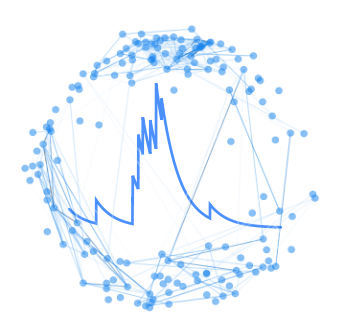

<!-- PROJECT SHIELDS -->
[![Contributors][contributors-shield]][contributors-url]
[![Forks][forks-shield]][forks-url]
[![Stargazers][stars-shield]][stars-url]
[![Issues][issues-shield]][issues-url]
[![MIT License][license-shield]][license-url]
[![LinkedIn][linkedin-shield]][linkedin-url]


<!-- PROJECT LOGO -->
<br />
<p align="center">
  <a href="https://github.com/vporubsky/CaGraph">
    
  </a>

  <h3 align="center">CaGraph</h3>

  <p align="center">
    Graph theory analysis and visualization package for calcium imaging timeseries data. The package makes it simple for experimental researchers to generate graphs 
    of functional networks and inspect their topology, using NetworkX to compute useful graph theory metrics. Bokeh is used to assist with interactive plotting of graph networks.
    <br />
    <a href="https://cagraph.readthedocs.io/en/latest/"><strong>Explore the docs »</strong></a>
    <br />
    <br />
    <a href="https://github.com/vporubsky/CaGraph">View Demo</a>
    ·
    <a href="https://github.com/vporubsky/CaGraph/issues">Report Bug</a>
    ·
    <a href="https://github.com/vporubsky/CaGraph/issues">Request Feature</a>
  </p>
</p>


<!-- TABLE OF CONTENTS -->
<details open="open">
  <summary><h2 style="display: inline-block">Table of Contents</h2></summary>
  <ol>
    <li>
      <a href="#about-the-project">About The Project</a>
    </li>
    <li>
      <a href="#getting-started">Getting Started</a>
      <ul>
        <li><a href="#prerequisites">Prerequisites</a></li>
        <li><a href="#installation">Installation</a></li>
      </ul>
    </li>
    <li><a href="#usage">Usage</a></li>
    <li><a href="#license">License</a></li>
    <li><a href="#contact">Contact</a></li>
    <li><a href="#acknowledgements">Acknowledgements</a></li>
  </ol>
</details>


<!-- ABOUT THE PROJECT -->
## About The Project

[![CaGraph Screen Shot][product-screenshot]](https://raw.githubusercontent.com/vporubsky/CaGraph/main/figures/figure_1.png)


<!-- GETTING STARTED -->
## Getting Started

To get a local copy up and running follow these simple steps.

### Prerequisites

A list of software required for the CaGraph project and how to install the packages.

* networkx
  ```sh
  pip install networkx
  ```
* bokeh
  ```sh
  pip install bokeh
  ```  
* numpy
  ```sh
  pip install numpy
  ```  
* matplotlib
  ```sh
  pip install matplotlib
  ```  
* pynwb
  ```sh
  pip install pynwb
  ```  
* scipy
  ```sh
  pip install scipy
  ```  
* seaborn
  ```sh
  pip install seaborn
  ```  
* statsmodels
  ```sh
  pip install statsmodels
  ```  
### Installation

1. Clone the repo
   ```sh
   git clone https://github.com/vporubsky/CaGraph.git
   ```
2. Install via PyPI
   ```sh
   pip install cagraph
   ```


<!-- USAGE EXAMPLES -->
## Usage

Examples of using the package will be added here. Additional screenshots, code examples and demos will be included formally in documentation.

Documentation to be added.


<!-- LICENSE -->
## License

Distributed under the MIT License. See `LICENSE` for more information.


<!-- CONTACT -->
## Contact

Veronica Porubksy - verosky@uw.edu

Project Link: [https://github.com/vporubsky/CaGraph](https://github.com/vporubsky/CaGraph)


<!-- ACKNOWLEDGEMENTS -->
## Acknowledgements

* [Sauro Lab at the University of Washington](https://sites.google.com/uw.edu/systems-biology-lab/home?authuser=1)
* [Bruchas Lab at the University of Washington](http://www.bruchaslab.org/)


<!-- MARKDOWN LINKS & IMAGES -->
<!-- https://www.markdownguide.org/basic-syntax/#reference-style-links -->
[contributors-shield]: https://img.shields.io/github/contributors/vporubsky/CaGraph.svg?style=for-the-badge
[contributors-url]: https://github.com/vporubsky/CaGraph/graphs/contributors
[forks-shield]: https://img.shields.io/github/forks/vporubsky/CaGraph.svg?style=for-the-badge
[forks-url]: https://github.com/vporubsky/CaGraph/network/members
[stars-shield]: https://img.shields.io/github/stars/vporubsky/CaGraph.svg?style=for-the-badge
[stars-url]: https://github.com/vporubsky/CaGraph/stargazers
[issues-shield]: https://img.shields.io/github/issues/vporubsky/CaGraph.svg?style=for-the-badge
[issues-url]: https://github.com/vporubsky/CaGraph/issues
[license-shield]: https://img.shields.io/github/license/vporubsky/CaGraph.svg?style=for-the-badge
[license-url]: https://github.com/vporubsky/CaGraph/blob/master/LICENSE.txt
[linkedin-shield]: https://img.shields.io/badge/-LinkedIn-black.svg?style=for-the-badge&logo=linkedin&colorB=555
[linkedin-url]: https://linkedin.com/in/vporubsky
[product-screenshot]: https://raw.githubusercontent.com/vporubsky/CaGraph/main/figures/figure_1.png
