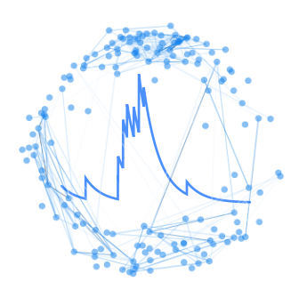

visualization
------------------

Python library for vizualizing graphs from calcium imaging data of neural activity.

API
----

.. automodule:: visualization
   :members:

Authors
----------

Veronica Porubsky

License
---------------

The package is released under the `MIT
License <https://opensource.org/licenses/MIT>`__.

